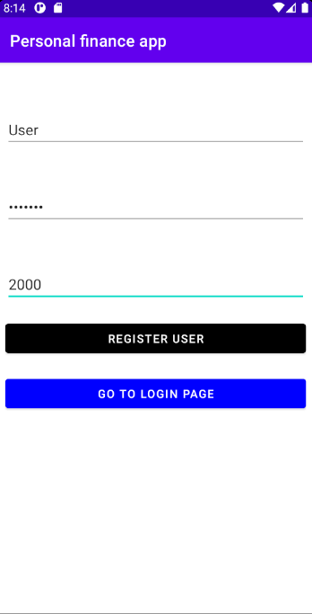
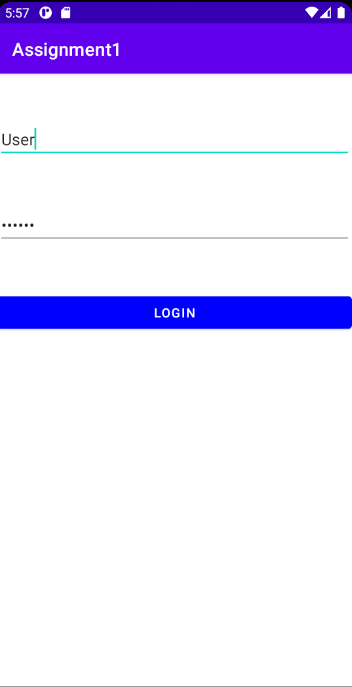
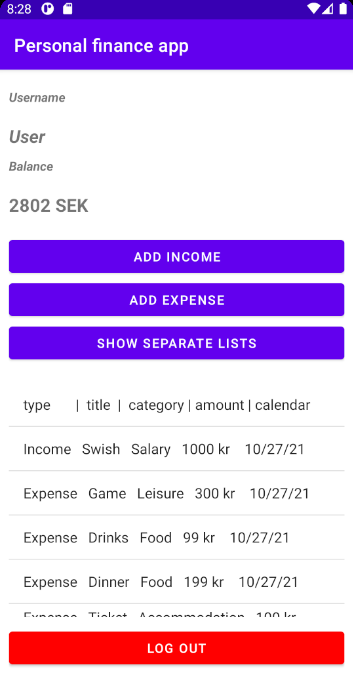
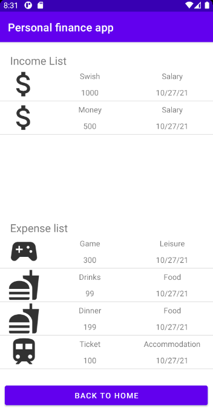

# Android_personal_finance_App

A personal finance android app where the user can add income and expenses to keep a track of own finance. All user info is stored in a SQLite database and fetched from that database.

The user can register by creating a account and selecting a start balance which takes the user to Home page. If the user already has a account you can go to Login Page.

    **********    

 

In the Home page the user can find the balance amount and a list of income and expenses. The user can also add a new income or expense. To see income and expenses in separate lists click the "SHOW SEPARATE LISTS" button.

 

The income and expenses are displayed in different lists.

